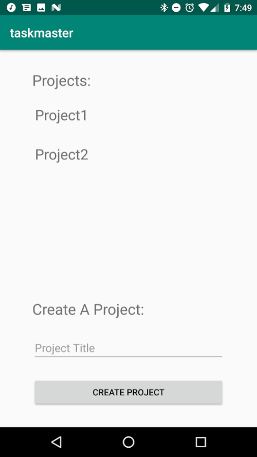

# TaskMaster

This week, we will build up an app that allows tracking tasks on a project. (Have you ever thought, “Trello boards are cool, but why do we have to use Trello?” Let’s solve that problem.) While we will start small today, this app will build up over time to create something fully-featured.

## Lab 40: Beginning TaskMaster
* Users should be able to create a Project.
* Users should be able to add a task to a Project.
  * Both Tasks and Projects should be saved locally to a database.
* A user should be able to “Assign” themselves a task, “Accept” that task, and later “Complete” that task.
* A task should have one property which represents what state the task is in.
  * Available - the task has been created, and is publicly available, but no other user has claimed it yet.
  * Assigned - someone has been assigned that task.
  * Accepted - the assignee has accepted that task.
  * Finished - the task is totally complete Write tests making sure a task progresses through it’s states properly.

|             Project List              |             Project1's Tasks           |             Project2's Tasks           |
|---------------------------------------|----------------------------------------|----------------------------------------|
|  |  |  |

## Information Structure Using Room

Project and Task are entities linked by the ProjectWithTasks Pojo (plain old Java object). Tasks have a field to keep track of the id of the project they belong to. ProjectWithTasks is connected to the project's id and the tasks stored copy of the project's id.

## Change Log
* Monday 1/28/2019 - Created project and database entities (Project and Task).
* Tuesday 1/29/2019 - Created project recycler view, ability to add projects to room and create an event listener to be used to add tasks to a project.
* Wednesday 1/20/2019 - Tasks can be added to projects

## Resources
* http://androidkt.com/database-relationships/
* http://www.vogella.com/tutorials/AndroidRecyclerView/article.html
* https://stackoverflow.com/questions/13593069/androidhide-keyboard-after-button-click/13593232 (second answer)
* https://stackoverflow.com/questions/44330452/android-persistence-room-cannot-figure-out-how-to-read-this-field-from-a-curso/44424148#44424148
* https://stackoverflow.com/questions/2091465/how-do-i-pass-data-between-activities-in-android-application
* https://stackoverflow.com/questions/4298225/how-can-i-start-an-activity-from-a-non-activity-class
* https://stackoverflow.com/questions/2091465/how-do-i-pass-data-between-activities-in-android-application
* https://developer.android.com/docs/